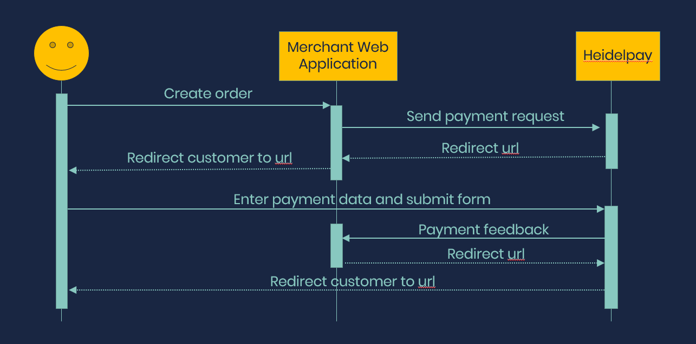

# Example SXC9 plugin for Heidelpay

This repository contains an example implementation of a Sitecore Experience Commerce 9 plugin for the [Heidelpay payment provider](https://www.heidelpay.com)

## Overview
This example implements the Heidelpay hCO payment flow, which looks like the following: 



The solutions has the following projects:

1. Plugin.Payment.Heidelpay
This is the SXC9 Heidelpay plugin and contains most of the interesting stuff.

2. Heidelpay.Connect
This library contains a connect API for using the heidelpay functionality from the experience platform.

3. engine
This is a copy of the commerce engine project that is part of the SDK.

4. Plugin.sample.habitat
This is the habitat plugin from the SDK and is used to import the Habitat test catalog.

5. Sitecore.Commerce.ServiceProxy
The service proxy from the SDK that has been re-generated to contain the Heidelpay specific stuff.

6. website
A MVC website with some example MVC controllers and views to demo and test the functionality.

## Getting started

1. Setup docker
This example uses the [Aviva sitecore commerce docker images](https://github.com/avivasolutionsnl/sitecore-commerce-docker) for development. Follow the instructions in that repository to build your own commerce docker images and run `docker-compose up` to start the environment.

2. Modify Heidelpay configuration
The Heidelpay settings are defined in a Heidelpay policy. These can be modified by editing the environmet files under `source/HeidelpayDemo/engine/data/Environments/Plugin.Habitat.Commerce*.json`. At the bottom of these files there is an element that starts with:
```
"$type": "Plugin.Payment.Heidelpay.Policies.HeidelpayPolicy, Plugin.Payment.Heidelpay"
```

This element contains the Heidelpay specific settings.

3. Build / Publish solution
Just build the solution from Visual Studio. Right click publish the engine and website projects to publish them to the build folder in this repository. The docker containers are set up to automtically copy the files in that build folder. 

4. Bootstrap / Initialize the SXC9 engine
Use postman to first `bootstrap` and then `initialize` the environment. This will import the Habitat test data into the environment. 

5. Run the demo
Make sure the docker containers are available by running the [whales-names](https://www.npmjs.com/package/whales-names) NPM package. The demo site will be accessible at [http://sitecore](http://sitecore). Also, for Heidelpay to be able to reach the site and provide transaction feedback, the development machine needs to be accessible from the internet. [ngrok](https://ngrok.com/) is a handy tool for this, that allows you to create a tunnel. Make sure to map it to the same port as is configured in the docker file:

`ngrok http 8181`

And make sure that the URl that is generated by ngrok is configured in the Heidelpay policy in the environment files (Don't forget to bootstrap). 